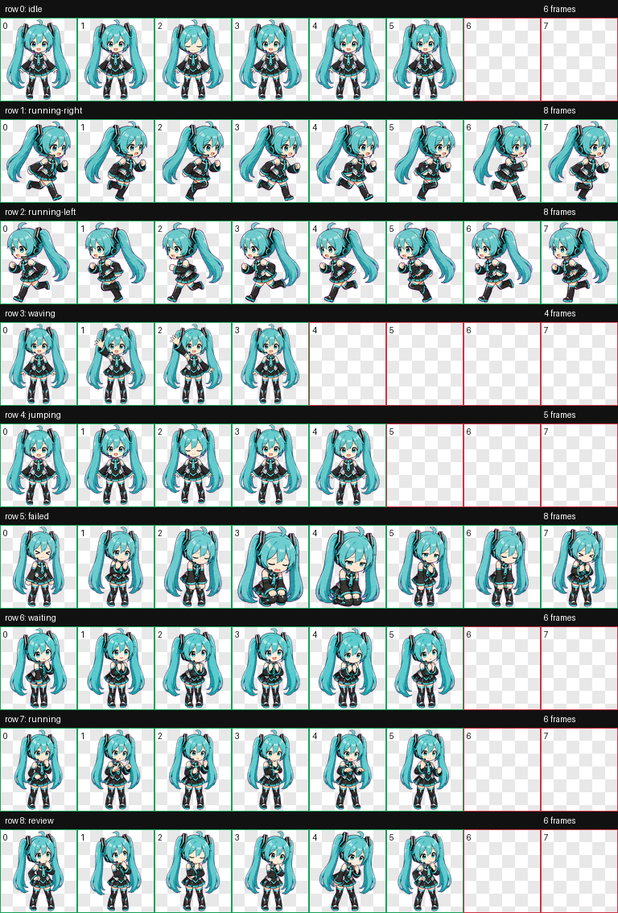

# Codex Pet Miku

An original teal twin-tail virtual singer pet for Codex Desktop, inspired by upbeat cyber-pop idol energy.

This is a custom Codex pet package with a full animated spritesheet and manifest.

## Preview



## Files

- `pet.json` - Codex pet manifest.
- `spritesheet.webp` - 8 x 9 Codex pet animation atlas.
- `preview/contact-sheet.png` - QA contact sheet showing all animation rows.

## Install

Copy this folder into your Codex pets directory:

```bash
mkdir -p ~/.codex/pets/miku-inspired
cp pet.json spritesheet.webp ~/.codex/pets/miku-inspired/
```

Restart Codex Desktop if the pet does not appear immediately.

## Animation Rows

- Row 0: idle
- Row 1: running-right
- Row 2: running-left
- Row 3: waving
- Row 4: jumping
- Row 5: failed
- Row 6: waiting
- Row 7: running
- Row 8: review

## Notes

The `jumping` row is intentionally subtle so hover-triggered repeat playback feels like a light bounce instead of a repeated full jump.
